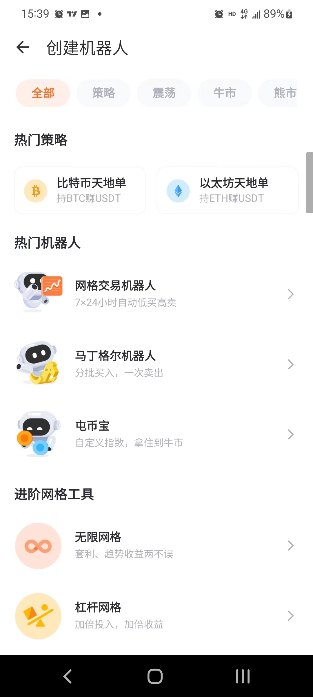

# 4.从韭菜到大神的10个工具


本站由@CryptoInfo博士 维护更新，欢迎加入电报群讨论。


<mark style="color:yellow;">**加密投资中，工具差等于财富差。**</mark>一个良好的资讯工具可以让你快人一步埋伏或者抛售，后来的人只能给你抬轿子；一个牛逼的数据平台可以让你提前洞察到市场中的价值洼地和泡沫，<mark style="color:yellow;">**买在无人问津时，卖在人声鼎沸处。**</mark>

## [一、查币查项目](https://coinmarketcap.com/)

**CoinMarketCap是全球最著名的加密综合类网站之一**，提供关于币种的实时价格、交易量、市值和流通供应量、可交易场所、项目日历等资讯。无论是你想研究一个项目的来龙去脉、买任何币种、提前埋伏利好机会，熟悉这个网站都是最基本的。

<figure><figcaption></figcaption></figure>

***

## [二、查聪明钱流向](https://www.nansen.ai/)

**Nansen，是一款全面的链上资金监控平台，**也是Info君最早掏腰包购买的一个付费工具（1000RMB一个月）这个平台提供针对具体Token/NFT链上资金动向，并且给大户巨鲸等地址打上标签，你可以观察到巨鲸的动向，比如他们最近买了什么Token，或者是持有哪些nft。

**特色功能有**：<mark style="color:yellow;">观察Token的上帝模式，聪明钱流向，NFT Paradise。</mark>

<figure><figcaption></figcaption></figure>

## [三、律动Blockbeats](https://www.theblockbeats.info/)

加密货币交易有一个非常重要的因素：消息面。关于市场的最新消息和公告，可以极大地影响市场的价格和交易量。如果你忽略了消息面，你可能会错过一些巨大的机会或遭受重大的损失。

一条小小的消息也可以改变市场的趋势，马斯克的一条推特会极大影响meme币，arb的空投带领arb生态币全部原地起飞，在加密世界，及时的消息面就是金钱。

**Blockbeats提供中文世界最全的快讯流**，可以帮助你最快掌握当下世界的热点新闻，此外，Blockbeats上有大量优质文章和教程，可以帮助你掌握当前热点赛道、项目机会、币圈基础等等。不可错过。

<figure><figcaption></figcaption></figure>

##

## [四、defiLlama](https://defillama.com/)

Defi赛道注定将是下一个牛市的火箭助燃剂，以OP，ARB，Stack为代表的众多二层项目很有可能出现多个十倍币，百倍币。<mark style="color:yellow;">如何查询他们生态中的潜力股呢？defillama帮你实现！</mark>

defiLlama是DeFi项目聚合器和分析平台，跟踪和汇总了众多的DeFi项目，包括去中心化交易所、借贷平台、流动性挖矿和其他类似的加密货币金融项目。通过defiLlama，您可以查看每个DeFi项目的总锁定价值、总流动性、24小时交易量、当前价格等信息。这些信息可以帮助您更好地挖掘潜力项目，做出更明智的投资决策。

defiLlama还提供了一些有用的工具，例如投资组合追踪器和收益计算器，帮助用户跟踪其在DeFi市场中的表现和计算收益。此外，defiLlama还提供了一些API接口，允许第三方开发人员访问和使用平台上的数据。

<figure><figcaption></figcaption></figure>

## [五、tradingview](https://www.tradingview.com/)

OK，你现在已经拥有了强力的消息面和资金面工具了，怎能错过**Tradingview这样一个全球最专业的看盘分析软件呢？**有了Tradingview的加持，什么指标分析、量化策略都难不倒你！

TradingView的图表功能非常强大，可以通过多种指标和工具来绘制股票、期货、外汇和加密货币等市场的图表，例如趋势线、移动平均线、相对强弱指标（RSI）等。同时，它还支持多种不同的时间周期，如分钟、小时、日等，方便用户对市场进行分析和交易决策。

除了图表分析，TradingView还提供了实时行情数据和新闻资讯，包括重要的财经指标、新闻报道和市场分析等。此外，您可以在平台上创建自己的观察列表，关注感兴趣的市场和股票，还可以与其他用户进行社区交流，分享投资想法和交易策略。

<figure><figcaption></figcaption></figure>

## [六、TwitterScan](https://twitterscan.com/)

**如果你已经不满足于在二级市场驰骋，准备进入NFT市场，**那么你不可以错过TwitterScan这款现象级的工具，用它来发现NFT的财富密码吧！

TwitterScan是一款能够帮助用户快速定位热门项目，以及判断优质用户，发掘新项目和甄别热门话题的一款工具。TwitterScan目前是一个免费的平台，您可以直接使用，是一个非常好的在NFT遴选上可以代替Nansen的工具网站，它有五大板块，分别是：

* <mark style="color:yellow;">trading token（趋势币种）</mark>
* <mark style="color:yellow;">trading Kol（大V动向）</mark>
* <mark style="color:yellow;">upcoming Drop（即将到来的NFT项目）</mark>
* <mark style="color:yellow;">Trading topic（热度版块）</mark>
* <mark style="color:yellow;">全局搜索功能</mark>

<figure><figcaption></figcaption></figure>


在您对NFT市场不够了解之前，请勿贸然购入NFT，NFT市场不同于炒币，一旦流动性枯竭，您手中的NFT可能完全无法卖出！


## [七、FMZ发明者量化](https://www.fmz.com/sign-up/6430459)

当你已经有一套成熟的稳定盈利的交易策略之后，你该怎么做？当然是写成自动交易脚本策略啦，躺在床上吃波段钱了！加密交易是一个365\*24h不间断的大池子，每时每刻，你都可以利用你的自动化交易策略进行自动买卖，为您赚取USDT！

FMZ发明者量化平台是我自己亲自用过，并且写了三十多套策略代码的平台，拥有丰富的量化交易工具和技术，包括自动交易、策略编写、数据分析、回测等功能，可以帮助您优化交易策略和提高交易效率。

FMZ支持Python、JavaScript、C++等，方便量化交易者根据自己的需求和技术水平编写自己的交易策略。此外，平台还提供了多个交易接口API，包括<mark style="color:yellow;">数字货币交易所、期货交易所、股票交易所</mark>等，为用户提供了广泛的交易市场选择。

<figure><figcaption></figcaption></figure>

## [八、派网Pionex](https://www.picolzh.com/zh-CN/sign/ref/n75MZTL2)

可能你会说，我不会编程怎么办呢？我也想躺着赚钱，但是就是写不了代码啊。没关系，派网(大陆叫派可）可以完美解决你这个问题，我从2020年开始使用派网的网格策略，只能说，用着很省心，体验比币安网格好太多了。

使用派网很简单，[**点击注册下载之后（减免20%手续费）**](https://www.picolzh.com/zh-CN/sign/ref/n75MZTL2)，和交易所一样，转U进去，可以买现货，也可以调用量化策略去自动交易。**全时段自动交易、无需盯盘，随时接针抄底。**它里面的自动交易策略包括：

* <mark style="color:yellow;">比特币/以太坊天地单</mark>
* <mark style="color:yellow;">网格交易机器人</mark>
* <mark style="color:yellow;">马丁格尔机器人</mark>
* <mark style="color:yellow;">定投囤币宝</mark>
* <mark style="color:yellow;">无限网格、杠杆网络、借贷网格、反向网格、波段追踪等</mark>

## 九、CryptoRobot工具箱

你很难在国内公众号上看到这么优秀的加密工具开发集成平台，良好的产品设计理念、优秀的UI界面设计、完备的小工具功能。值得一提的是消息面极速情报速递功能，基本是市面上最快最全的价值新闻爬取了；加密利好事件采用多源数据给出近期热门项目事件，对于牛市中做长线埋伏的散户来说简直就是福音；多空指示器利用十几种技术指标耦合给出当前趋势预判，我个人认为也是罕见的优秀工具。

目前，解锁全部功能需要付费或邀请好友，不过性价比绝对OK。工具箱中还有十余种有趣的小工具，大家自行探索。<mark style="color:yellow;">【公众号搜索-CryptoRobot】</mark>

<figure><figcaption></figcaption></figure>

## [十、高阶玩家的最爱—dune](https://dune.com/browse/dashboards)

<mark style="color:yellow;">可以说，只要掌握基本的SQL语言，你可以在Dune上获取一切关于区块链的数据。</mark>Dune Analytics是一个区块链数据分析平台，旨在帮助用户轻松地进行数据分析和可视化。任何人都可以使用它来探索各条链上的数据，并通过查询、图表和可视化工具进行分析和展示。

Dune Analytics平台支持以太坊区块链、DeFi（去中心化金融）协议、智能合约等，用户可以通过自定义查询语言（Dune Query Language）查询和分析这些数据。此外，Dune Analytics平台还支持多种图表和可视化工具，例如柱状图、线图、饼图、散点图等，用户可以根据需要选择适合的图表类型进行数据展示和分析。

Dune Analytics平台的优点在于其开放性和易用性，任何人都可以使用该平台进行数据分析和可视化，而不需要事先拥有深厚的编程技能或数据分析经验。此外，Dune Analytics平台还具有灵活性，用户可以根据需要自定义查询和可视化工具，以适应不同的数据分析需求。

<figure><figcaption></figcaption></figure>

