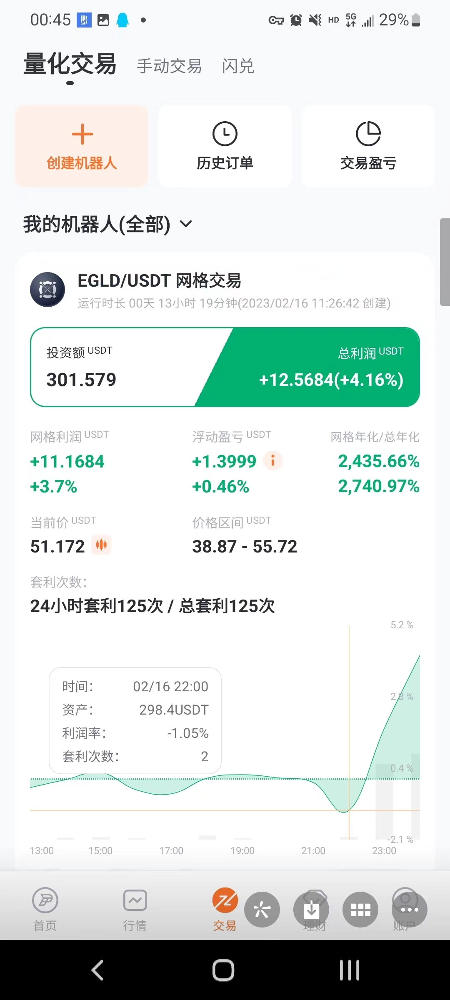

# 派网网格策略参数选择


[点击注册派网（可）](https://www.picolzh.com/zh-CN/sign/ref/n75MZTL2)，开启USDT印钞机！（永久减免20%手续费）


**在不同的市场行情中选择适当的网格策略参数对于实现更高收益至关重要。像我这个网格开了13个小时就盈利4.16%，就很舒服。下面给一些网格使用建议：**

********

1. <mark style="color:yellow;">震荡市场（Sideways market）：</mark> 震荡市场指的是价格在一个相对较小的区间内波动，没有明显的上升或下降趋势。在这种市场环境下，您可以选择较小的网格大小（较密集的买卖点），以便在价格波动过程中更频繁地买入和卖出。同时，可以将价格区间设置为接近当前价格的水平，以便在波动过程中尽可能多地捕捉交易机会。
2. <mark style="color:yellow;">上升趋势市场（Bull market）：</mark> 在上升趋势市场中，价格整体呈上升趋势。在这种情况下，可以将价格区间设置为当前价格的上方，以便在价格上涨过程中逐步卖出资产。同时，可以适当增加网格大小（较宽松的买卖点），因为在上升趋势中，价格可能较快地穿过网格。此外，可以考虑将头寸大小进行递减，即在价格上涨时逐步减少卖出的数量，以便在趋势继续时保持更多的资产。
3. <mark style="color:yellow;">下降趋势市场（Bear market）：</mark> 在下降趋势市场中，价格整体呈下降趋势。在这种情况下，可以将价格区间设置为当前价格的下方，以便在价格下跌过程中逐步买入资产。与上升趋势市场类似，可以适当增加网格大小（较宽松的买卖点），并考虑将头寸大小进行递增（马丁），即在价格下跌时逐步增加买入的数量。
4. <mark style="color:yellow;">高波动性市场（High volatility market）：</mark> 在高波动性市场中，价格波动幅度较大，但方向不明确。在这种情况下，可以将价格区间设置得较宽，以便捕捉大幅波动的机会。同时，可以选择较大的网格大小（较宽松的买卖点），以避免频繁的买卖操作导致交易成本过高。在高波动性市场中，适当的风险管理尤为重要，因此要确保为每个网格分配合适的头寸大小。
