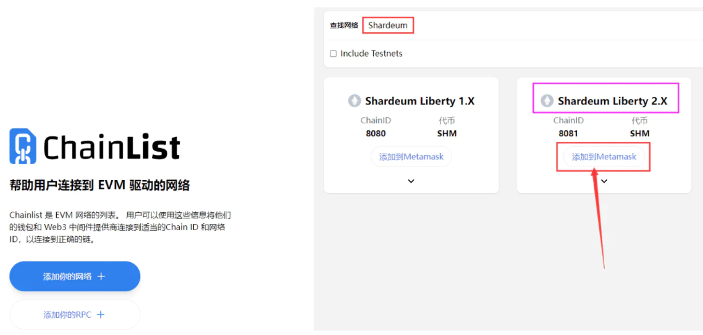

# Shardeum交互潜在空投

准备工具：小狐狸钱包，DC\
\
官方DC：[https://discord.gg/shardeum](https://discord.gg/shardeum)\

下面开始交互→\
\
**一：设置测试网络，领水**

**打开网址：**[https://chainlist.org/zh?search=Shardeum](https://chainlist.org/zh?search=Shardeum)\
**1：所搜 Shardeum**

**2：选择第二个 2.X 这个网络**

**3：点击添加到钱包，钱包批准确认**\

<figure><figcaption></figcaption></figure>

****\
**加入官方discord：**[https://discord.gg/shardeum](https://discord.gg/shardeum)

<figure><figcaption></figcaption></figure>

#### 二：测试网手动部署合约

**打开网址：**[**https://docs.openzeppelin.com/contracts/4.x/wizard**](https://docs.openzeppelin.com/contracts/4.x/wizard)****\
****\
****

<figure><figcaption></figcaption></figure>

**1：输入你要发行的代币名称（英文加数字）**\
**2：输入代币简称 如：op**\
**3：输入你要发行的代币数量**\
**4：点击 Open in Remix 按钮**\
****\
****

<figure><figcaption></figcaption></figure>

**我们选择最左侧的第三个按钮选项，然后点击 Compile XXXX 这个按钮，进行编译合约操作**\
****\
****

<figure><figcaption>
<mark style="color:red;"><strong>如果编译没有错误，您会在“Solidity Compiler”按钮上看到一个绿色的勾勾标记</strong></mark>
</figcaption></figure>

<figure><figcaption></figcaption></figure>

**1：我们选择最左侧的第四个按钮 部署按钮**\
**2：在 ENVIRONMENT 选项中选择“Injected Provider MetaMask”，钱包确认**\
**3：点击Deploy ，钱包确认**\
****\
****

<figure><figcaption>
<mark style="color:red;"><strong>部署成功后，你就可以看到这样的提示</strong></mark>
</figcaption></figure>

_**后面还需要持续关注SHM上面的其他测试毕竟是公链！**_
