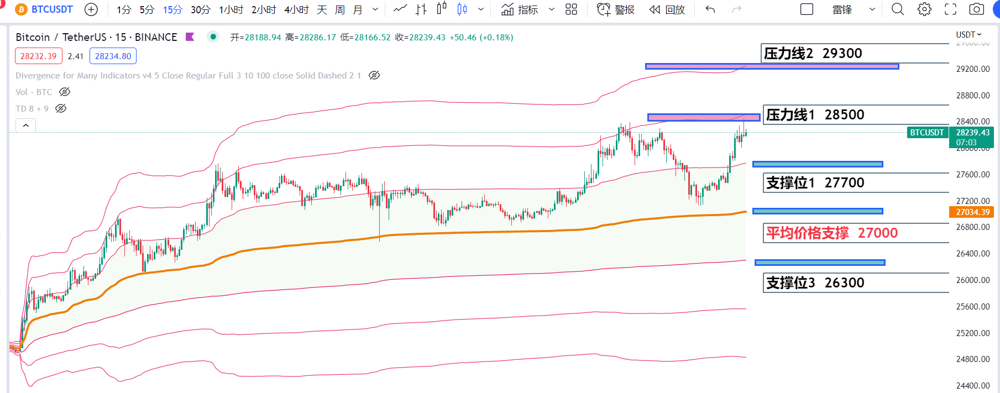

# CryptoInfo技术频道


编辑于2023.03.20

\#BTC技术面晚报&#x20;

今日凌晨冲高到28390后开始回落，但整体趋势依旧向上，短期大级别回调概率很低，反而在BTC盘整期间是山寨们的机会，我们要寻找各种交易标的和机会。

利用anchored VWAP指标，我们可以看到当前短期投资者的平均价格为27000左右，我们如能突破站稳上方28500压力线，上看到29300；否则，27700和27000是短期两个重要的支撑位。


<figure><figcaption></figcaption></figure>
