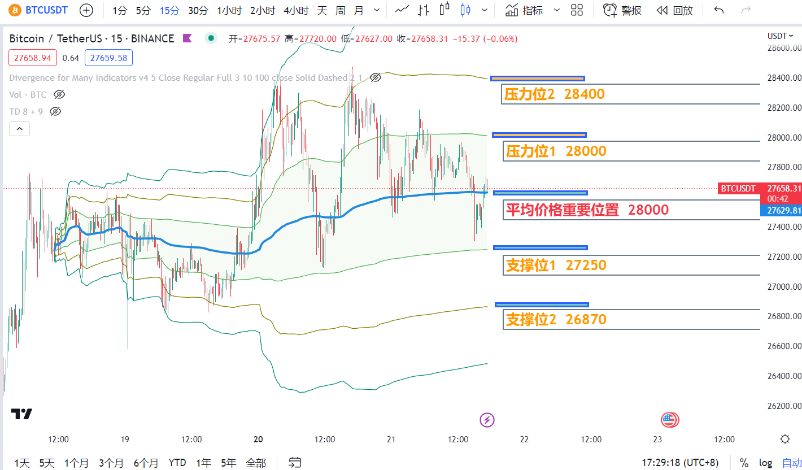

# CryptoInfo技术频道


编辑于2023.03.21

\#BTC技术面晚报 当前的市场增量资金有限，所以当比特币上涨的时候，你会发现山寨也带不动了，唯独比特币独自上扬。从当前走势来看，短期上涨有点乏力，可能会继续以调整为主。市场可能都在等美联储的加息决议，这个时间点是本周四凌晨2点。

加息决议宣布之后，市场在之后一个月多时间进入金融事件真空期，所以市场会有大量的时间狂欢。

利用anchored VWAP指标，<mark style="color:yellow;">我们昨日准确预测到了昨晚27700左右的一波支撑反弹以及凌晨跌破后的一波下坠。</mark>目前，我们看到当前短期投资者的平均价格为<mark style="color:yellow;">27627</mark>左右，我们如能突破站稳<mark style="color:yellow;">27627压力线，上看到28000；否则，27250和26870是短期两个重要的支撑位。</mark>


<figure><figcaption></figcaption></figure>


编辑于2023.03.20

\#BTC技术面晚报&#x20;

今日凌晨冲高到28390后开始回落，但整体趋势依旧向上，短期大级别回调概率很低，反而在BTC盘整期间是山寨们的机会，我们要寻找各种交易标的和机会。

利用anchored VWAP指标，我们可以看到当前短期投资者的平均价格为27000左右，我们如能突破站稳上方28500压力线，上看到29300；否则，27700和27000是短期两个重要的支撑位。


<figure><figcaption></figcaption></figure>
